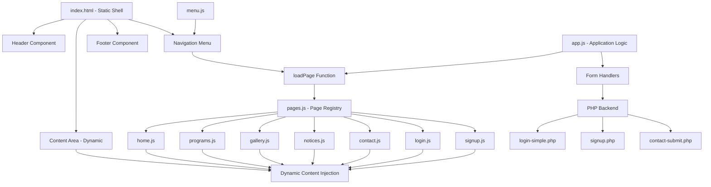
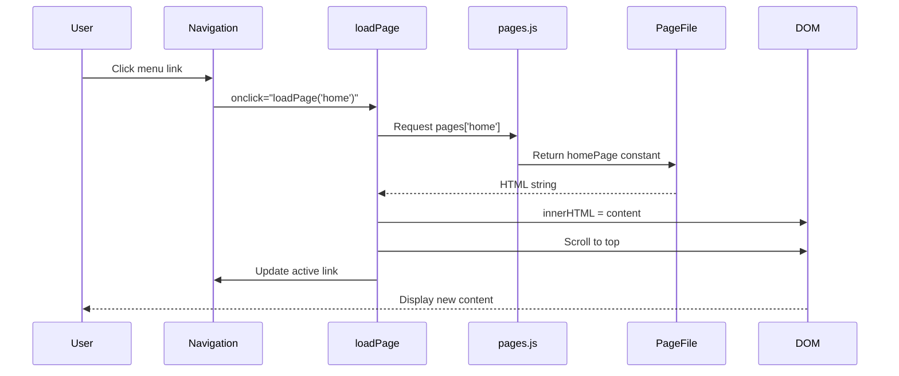
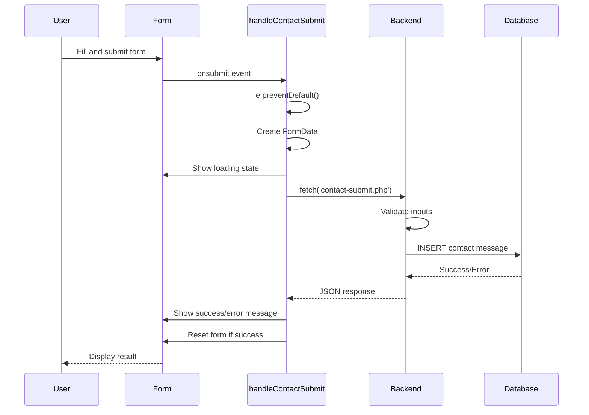
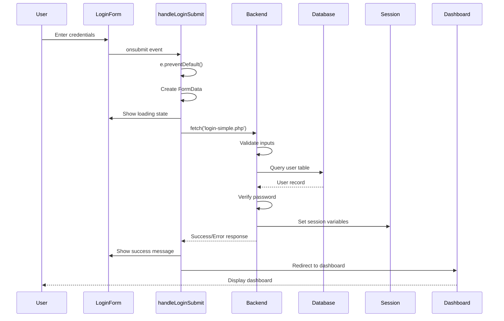

# Design Document: School Website Documentation

## Overview

The Sindhuli Community Technical Institute (SCTI) website is a Single-Page Application (SPA) built with vanilla JavaScript, HTML, and CSS. The application uses dynamic content loading to provide a seamless user experience without full page reloads. The index.html file serves as a static shell containing the header, navigation, and footer, while page content is dynamically injected into a content area using JavaScript. The website provides information about programs, campus facilities, events, and contact details, along with user authentication features (login/signup) that integrate with a PHP backend.

## Architecture

The website follows a Single-Page Application (SPA) architecture with client-side routing and dynamic content injection.



## SPA Architecture and Dynamic Content Loading

### Core Concept

The application uses a single HTML file (index.html) as a shell that never reloads. All page transitions happen by:
1. User clicks a navigation link with onclick handler
2. loadPage() function is called with page name
3. Content is fetched from JavaScript page objects
4. Content is injected into #content-area div
5. Page scrolls to top and mobile menu closes

### Static Shell Structure (index.html)

The index.html file contains:
- Top header with marquee announcements
- Sticky header with logo and navigation
- Empty #content-area div for dynamic content
- Footer with copyright
- Script tags loading all JavaScript modules

### Dynamic Content Injection

Content injection happens through innerHTML replacement:
```javascript
const contentArea = document.getElementById('content-area');
contentArea.innerHTML = pages[pageName] || pages.home;
```

Each page's HTML is stored as a template literal string in its respective JavaScript file.

## JavaScript Module Structure

### Module Loading Order

Scripts are loaded in this specific order in index.html:
1. menu.js - Mobile menu toggle functionality
2. Page-specific files (home.js, programs.js, gallery.js, notices.js, contact.js, login.js, signup.js)
3. pages.js - Page registry object
4. app.js - Application initialization and form handlers

### Module Descriptions

#### 1. menu.js
**Purpose**: Handles mobile menu toggle functionality

**Functionality**:
- Listens for click on #menu-toggle button
- Toggles 'show' class on #menu element
- Enables responsive navigation on mobile devices

**Code**:
```javascript
document.getElementById("menu-toggle").onclick = function () {
  document.getElementById("menu").classList.toggle("show");
};
```

#### 2. Page-Specific Files (assets/js/pages/)

Each page file exports a constant containing HTML as a template literal:
- **home.js**: Exports `homePage` - Banner, notices, events, campus info, courses, teachers
- **programs.js**: Exports `programsPage` - Program listings with accordion functionality
- **gallery.js**: Exports `galleryPage` - Photo gallery grid with overlay effects
- **notices.js**: Exports `noticesPage` - Notice board cards with dates and badges
- **contact.js**: Exports `contactPage` - Contact form and information
- **login.js**: Exports `loginPage` - Login form with password toggle
- **signup.js**: Exports `signupPage` - Signup form with validation UI

**Structure Pattern**:
```javascript
const pageName = `
  <section class="section">
    <!-- HTML content here -->
  </section>
`;
```

#### 3. pages.js
**Purpose**: Central registry mapping page names to content

**Functionality**:
- Creates a single `pages` object
- Maps page identifiers to their HTML content
- Used by loadPage() to retrieve content

**Code**:
```javascript
const pages = {
  home: homePage,
  programs: programsPage,
  gallery: galleryPage,
  notices: noticesPage,
  contact: contactPage,
  login: loginPage,
  signup: signupPage
};
```

#### 4. app.js
**Purpose**: Application initialization and core functionality

**Functionality**:
- Defines loadPage() function for content switching
- Handles form submissions (contact, login, signup)
- Initializes application on window load
- Manages AJAX requests to PHP backend

**Key Functions**:
- `loadPage(pageName)` - Main content switching function
- `handleContactSubmit(e)` - Contact form AJAX handler
- `handleLoginSubmit(e)` - Login form AJAX handler
- `handleSignupSubmit(e)` - Signup form with client-side validation
- `window.onload` - Loads home page by default

## The loadPage() Function

### Function Signature
```javascript
function loadPage(pageName)
```

### How It Works

**Step 1: Content Retrieval**
```javascript
const contentArea = document.getElementById('content-area');
contentArea.innerHTML = pages[pageName] || pages.home;
```
- Gets reference to #content-area div
- Retrieves HTML from pages object using pageName key
- Falls back to home page if pageName not found
- Replaces innerHTML with new content

**Step 2: Page-Specific Initialization**
```javascript
if (pageName === 'signup') {
  setTimeout(() => {
    initSignupValidation();
  }, 100);
}
```
- Checks if signup page was loaded
- Initializes password validation after 100ms delay
- Delay ensures DOM elements are rendered

**Step 3: Scroll to Top**
```javascript
window.scrollTo({ top: 0, behavior: 'smooth' });
```
- Smoothly scrolls page to top
- Provides consistent user experience

**Step 4: Close Mobile Menu**
```javascript
document.getElementById("menu").classList.remove("show");
```
- Closes mobile menu if open
- Prevents menu staying open after navigation

**Step 5: Update Active Menu Item**
```javascript
document.querySelectorAll('.menu ul li a').forEach(link => {
  link.classList.remove('active');
});
event.target.classList.add('active');
```
- Removes 'active' class from all menu links
- Adds 'active' class to clicked link
- Provides visual feedback for current page

### Usage in Navigation

Navigation links use onclick handlers:
```html
<a href="#" onclick="loadPage('home'); return false;">Home</a>
```
- `onclick` calls loadPage with page name
- `return false` prevents default link behavior
- `href="#"` provides fallback for accessibility

## Navigation System and Event Handling

### Navigation Structure

The navigation menu is defined in index.html:
```html
<nav class="menu" id="menu">
  <ul>
    <li><a href="#" onclick="loadPage('home'); return false;">Home</a></li>
    <li><a href="#" onclick="loadPage('programs'); return false;">Programs</a></li>
    <li><a href="#" onclick="loadPage('gallery'); return false;">Gallery</a></li>
    <li><a href="#" onclick="loadPage('notices'); return false;">Notice Board</a></li>
    <li><a href="#" onclick="loadPage('contact'); return false;">Contact Us</a></li>
    <li><a href="#" onclick="loadPage('login'); return false;">Login</a></li>
    <li><a href="#" onclick="loadPage('signup'); return false;">Sign Up</a></li>
  </ul>
</nav>
```

### Event Handling Approach

**Inline Event Handlers**:
- Uses onclick attributes directly in HTML
- Calls loadPage() with specific page name
- Returns false to prevent default link behavior
- Simple and direct approach for small applications

**Mobile Menu Toggle**:
- Separate event handler in menu.js
- Uses getElementById and classList.toggle
- Responsive design pattern for mobile devices

**Form Event Handlers**:
- Defined in page HTML using onsubmit attribute
- Example: `<form onsubmit="handleContactSubmit(event)">`
- Prevents default form submission
- Handles AJAX requests instead

### Preventing Page Reloads

Multiple strategies prevent full page reloads:
1. `return false` in onclick handlers
2. `e.preventDefault()` in form handlers
3. `href="#"` as placeholder (doesn't navigate)
4. AJAX for backend communication

## Page-Specific Functionality

### Home Page (home.js)
**Content Sections**:
- Banner image
- Notice board preview (recent 4 notices)
- Recent events preview
- Campus information with image
- Popular courses grid
- Teacher profiles grid

**Features**:
- Static content display
- No interactive elements
- Responsive grid layouts

### Programs Page (programs.js)
**Content**: Program listings for different departments

**Features**:
- Accordion-style program cards
- Expandable/collapsible sections
- Program details (duration, eligibility, career prospects)

**Interactive Elements**:
- Click to expand program details
- Smooth transitions

### Gallery Page (gallery.js)
**Content**: Photo gallery grid

**Features**:
- Grid layout with 8 images
- Hover overlay effects
- Image captions with icons
- Responsive grid (adjusts columns based on screen size)

**Interactive Elements**:
- Hover reveals overlay with title
- CSS transitions for smooth effects

### Notices Page (notices.js)
**Content**: Notice board with announcements

**Features**:
- Notice cards with dates
- Urgent badge for important notices
- "Read More" links
- Chronological ordering

**Interactive Elements**:
- Hover effects on cards
- Click to read full notice (placeholder links)

### Contact Page (contact.js)
**Content**: Contact form and information

**Features**:
- Contact information display (address, phone, email, hours)
- Contact form with validation
- Icon-based visual design

**Interactive Elements**:
- Form submission via AJAX
- Real-time validation
- Success/error messages
- Loading state during submission

**Form Fields**:
- Full Name (required)
- Email Address (required, validated)
- Phone Number (required, validated)
- Subject (required)
- Message (required)

**Validation**:
- Client-side validation in handleContactSubmit()
- Server-side validation in contact-submit.php
- Email format validation
- Phone number format validation

### Login Page (login.js)
**Content**: Login form for students, teachers, and administrators

**Features**:
- User type selection (student/teacher/admin)
- Username and password fields
- Password visibility toggle
- Remember me checkbox
- Forgot password link
- Link to signup page

**Interactive Elements**:
- Password show/hide toggle
- Form submission via AJAX
- Success/error messages
- Automatic redirect to appropriate dashboard

**Form Fields**:
- User Type (dropdown: student/teacher/admin)
- Username (text)
- Password (password with toggle)
- Remember Me (checkbox)

**Password Toggle**:
```javascript
function toggleLoginPassword() {
  const passwordInput = document.getElementById('password');
  const toggleIcon = document.getElementById('togglePassword');
  
  if (passwordInput.type === 'password') {
    passwordInput.type = 'text';
    toggleIcon.classList.remove('fa-eye');
    toggleIcon.classList.add('fa-eye-slash');
  } else {
    passwordInput.type = 'password';
    toggleIcon.classList.remove('fa-eye-slash');
    toggleIcon.classList.add('fa-eye');
  }
}
```

### Signup Page (signup.js)
**Content**: Registration form for new users

**Features**:
- User type selection
- Full name, username, email fields
- Password with strength indicator
- Confirm password with match validation
- Real-time password validation
- Password visibility toggles

**Interactive Elements**:
- Real-time password strength meter
- Password requirement checklist
- Password match indicator
- Form submission via AJAX
- Success/error messages
- Automatic redirect to dashboard

**Form Fields**:
- User Type (dropdown: student/teacher/admin)
- Full Name (text)
- Username (text)
- Email (email, validated)
- Password (password with validation)
- Confirm Password (password with match check)

**Password Validation Rules**:
- Length: 7-12 characters
- At least one uppercase letter
- At least one lowercase letter
- At least one number
- At least one special character (!@#$%^&*)

**Real-Time Validation**:
```javascript
function initSignupValidation() {
  const passwordInput = document.getElementById('signupPassword');
  const confirmPasswordInput = document.getElementById('confirmPassword');
  
  // Validation checks object
  const checks = {
    length: { element: document.getElementById('lengthCheck'), regex: /^.{7,12}$/ },
    uppercase: { element: document.getElementById('uppercaseCheck'), regex: /[A-Z]/ },
    lowercase: { element: document.getElementById('lowercaseCheck'), regex: /[a-z]/ },
    number: { element: document.getElementById('numberCheck'), regex: /[0-9]/ },
    special: { element: document.getElementById('specialCheck'), regex: /[!@#$%^&*]/ }
  };
  
  // Real-time validation on input
  passwordInput.addEventListener('input', function() {
    // Check each rule and update UI
    // Update strength bar (weak/medium/strong)
    // Check password match
  });
}
```

**Password Strength Indicator**:
- Weak: 0-2 rules met (red bar, 33% width)
- Medium: 3-4 rules met (yellow bar, 66% width)
- Strong: 5 rules met (green bar, 100% width)

## Backend Integration (PHP)

### Overview

The SPA communicates with PHP backend files for:
- User authentication (login)
- User registration (signup)
- Contact form submission
- Database operations

All backend communication uses AJAX (Fetch API) to avoid page reloads.

### Backend Files

#### 1. login-simple.php
**Location**: pages/login-simple.php

**Purpose**: Handles user authentication

**Request Method**: POST

**Request Parameters**:
- username (string)
- password (string)
- userType (string: 'student', 'teacher', or 'admin')

**Process**:
1. Validates all fields are present
2. Determines database table based on userType
3. Queries database for user with matching username
4. Verifies password using password_verify()
5. Sets session variables if successful
6. Redirects to appropriate dashboard

**Response**:
- Success: HTTP redirect to dashboard
- Error: HTML with error message in .alert-danger div

**Session Variables Set**:
- user_id
- username
- user_type
- full_name
- email
- logged_in

**Database Tables**:
- students (for student login)
- teachers (for teacher login)
- admins (for admin login)

**Security Features**:
- Password hashing verification
- Prepared statements (SQL injection prevention)
- Session management
- Input validation

#### 2. signup.php
**Location**: pages/signup.php

**Purpose**: Handles user registration

**Request Method**: POST

**Request Parameters**:
- userType (string: 'student', 'teacher', or 'admin')
- fullName (string)
- username (string)
- email (string)
- password (string)
- confirmPassword (string)

**Process**:
1. Validates all fields are present
2. Checks if username already exists
3. Checks if email already registered
4. Validates password requirements
5. Hashes password using password_hash()
6. Inserts new user into appropriate table
7. Sets session variables
8. Redirects to appropriate dashboard

**Response**:
- Success: HTTP redirect to dashboard
- Error: HTML with error message in .alert-danger div

**Validation**:
- All fields required
- Email format validation
- Password length (7-12 characters)
- Password complexity requirements
- Username uniqueness
- Email uniqueness

**Security Features**:
- Password hashing (bcrypt)
- Prepared statements
- Input sanitization
- Duplicate prevention

#### 3. contact-submit.php
**Location**: pages/contact-submit.php

**Purpose**: Handles contact form submissions

**Request Method**: POST

**Request Parameters**:
- name (string)
- email (string)
- phone (string)
- subject (string)
- message (string)

**Process**:
1. Validates all fields are present
2. Validates email format
3. Validates phone number format
4. Inserts contact message into database
5. Returns JSON response

**Response Format** (JSON):
```javascript
{
  "success": true/false,
  "message": "Success or error message"
}
```

**Database Table**: contacts

**Database Fields**:
- name
- email
- phone
- subject
- message
- status (default: 'new')
- created_at (timestamp)

**Validation**:
- All fields required
- Email format (FILTER_VALIDATE_EMAIL)
- Phone format (regex: /^[0-9+\-\s()]+$/)

### AJAX Communication Pattern

All form handlers follow this pattern:

**1. Prevent Default Submission**:
```javascript
e.preventDefault();
```

**2. Create FormData Object**:
```javascript
const formData = new FormData(e.target);
```

**3. Show Loading State**:
```javascript
messageDiv.innerHTML = '<div class="alert alert-info">Processing...</div>';
```

**4. Send Fetch Request**:
```javascript
fetch('pages/endpoint.php', {
  method: 'POST',
  body: formData
})
```

**5. Handle Response**:
```javascript
.then(response => response.json()) // or .text() for HTML
.then(data => {
  // Show success/error message
  // Redirect if successful
})
```

**6. Handle Errors**:
```javascript
.catch(error => {
  // Show error message
  console.error('Error:', error);
})
```

**7. Reset UI State**:
```javascript
.finally(() => {
  // Re-enable buttons
  // Reset loading states
})
```

### Error Handling

**Client-Side**:
- Form validation before submission
- Real-time validation feedback
- Error messages displayed in UI
- Loading states during requests

**Server-Side**:
- Input validation
- Database error handling
- Try-catch blocks
- Descriptive error messages

**Response Parsing**:
- Login/Signup: Parse HTML response for error divs
- Contact: Parse JSON response for success/message fields

## Data Flow Diagrams

### Page Navigation Flow


### Form Submission Flow (Contact)


### Authentication Flow (Login)


## Application Initialization

### Window Load Event
```javascript
window.onload = function() {
  loadPage('home');
};
```

**Process**:
1. Browser finishes loading all resources
2. window.onload event fires
3. loadPage('home') is called
4. Home page content is injected
5. User sees home page by default

### Script Loading Order

The order of script tags in index.html is critical:

1. **menu.js** - Must load first for mobile menu functionality
2. **Page files** - Define page content constants
3. **pages.js** - Depends on page constants being defined
4. **app.js** - Depends on pages object existing

If loaded out of order, references will be undefined and application will fail.

## Styling and CSS

### CSS Architecture

**Single Stylesheet**: assets/css/style.css

**Styling Approach**:
- Global styles for common elements
- Component-specific styles
- Responsive design with media queries
- CSS transitions and animations

### Dynamic Styles

Some pages include inline `<style>` tags within their HTML:
- Login page: Password toggle styles, alert animations
- Signup page: Password strength indicator, validation list styles

These styles are injected with the page content and apply only when that page is active.

### Responsive Design

**Breakpoints**:
- Desktop: Default styles
- Tablet: ~768px and below
- Mobile: ~480px and below

**Mobile Menu**:
- Hidden by default on mobile
- Toggle button visible
- Slides in when 'show' class added
- Closes automatically after navigation

## Security Considerations

### Client-Side Security

**Input Validation**:
- Email format validation
- Phone number format validation
- Password complexity requirements
- Required field checks

**XSS Prevention**:
- User input not directly inserted into DOM without validation
- Backend sanitizes inputs before database insertion

**CSRF Protection**:
- Forms submit to same-origin backend
- Session-based authentication

### Server-Side Security

**Password Security**:
- Passwords hashed using password_hash() (bcrypt)
- Never stored in plain text
- Verified using password_verify()

**SQL Injection Prevention**:
- Prepared statements with bound parameters
- PDO with parameterized queries

**Session Security**:
- Session variables for authentication state
- Server-side session validation

**Input Sanitization**:
- trim() removes whitespace
- htmlspecialchars() prevents XSS
- filter_var() validates email format

## Performance Considerations

### Advantages of SPA Architecture

**Fast Navigation**:
- No full page reloads
- Only content area updates
- Instant page transitions

**Reduced Server Load**:
- Static assets cached by browser
- Only AJAX requests hit server
- Minimal bandwidth usage

**Better User Experience**:
- Smooth transitions
- No white screen flashes
- Persistent header/footer

### Potential Optimizations

**Code Splitting**:
- Currently all page files load upfront
- Could lazy-load pages on demand

**Caching**:
- Browser caches static assets
- Could implement service worker for offline support

**Minification**:
- JavaScript and CSS not minified
- Could reduce file sizes

## Testing Strategy

### Manual Testing Checklist

**Navigation**:
- [ ] All menu links work
- [ ] Active link highlights correctly
- [ ] Mobile menu toggles properly
- [ ] Page scrolls to top on navigation

**Forms**:
- [ ] Contact form submits successfully
- [ ] Login form authenticates correctly
- [ ] Signup form creates new users
- [ ] Validation messages display properly
- [ ] Error handling works

**Responsive Design**:
- [ ] Layout adapts to different screen sizes
- [ ] Mobile menu works on small screens
- [ ] Images scale appropriately
- [ ] Forms are usable on mobile

**Backend Integration**:
- [ ] AJAX requests complete successfully
- [ ] Database operations work correctly
- [ ] Session management functions properly
- [ ] Redirects work after authentication

### Browser Compatibility

**Target Browsers**:
- Chrome (latest)
- Firefox (latest)
- Safari (latest)
- Edge (latest)

**JavaScript Features Used**:
- Fetch API (modern browsers)
- Template literals (ES6)
- Arrow functions (ES6)
- const/let (ES6)

## Dependencies

### External Libraries

**Font Awesome 7.0.1**:
- CDN: https://cdnjs.cloudflare.com/ajax/libs/font-awesome/7.0.1/css/all.min.css
- Used for: Icons throughout the application

### Backend Dependencies

**PHP**:
- Version: 7.4+ recommended
- Extensions: PDO, pdo_mysql

**Database**:
- MySQL or MariaDB
- Tables: students, teachers, admins, contacts

**Configuration**:
- includes/config.php - Database connection configuration
- getDBConnection() function for PDO connection

### File Structure

```
project-root/
├── index.html                 # Static shell
├── assets/
│   ├── css/
│   │   └── style.css         # Global styles
│   ├── js/
│   │   ├── app.js            # Application logic
│   │   ├── menu.js           # Mobile menu
│   │   ├── pages.js          # Page registry
│   │   └── pages/
│   │       ├── home.js       # Home page content
│   │       ├── programs.js   # Programs page content
│   │       ├── gallery.js    # Gallery page content
│   │       ├── notices.js    # Notices page content
│   │       ├── contact.js    # Contact page content
│   │       ├── login.js      # Login page content
│   │       └── signup.js     # Signup page content
│   └── images/               # Image assets
├── pages/
│   ├── login-simple.php      # Login backend
│   ├── signup.php            # Signup backend
│   └── contact-submit.php    # Contact backend
├── includes/
│   └── config.php            # Database configuration
└── dashboards/
    ├── student-dashboard.php  # Student dashboard
    ├── teacher-dashboard.php  # Teacher dashboard
    └── admin-dashboard.php    # Admin dashboard
```

## Future Enhancements

### Potential Improvements

**Client-Side Routing**:
- Implement hash-based routing (#/home, #/programs)
- Browser back/forward button support
- Bookmarkable URLs

**State Management**:
- Centralized application state
- User session persistence
- Local storage for preferences

**Progressive Web App**:
- Service worker for offline support
- App manifest for installability
- Push notifications

**Performance**:
- Lazy loading of page modules
- Image optimization
- Code minification and bundling

**Accessibility**:
- ARIA labels for dynamic content
- Keyboard navigation support
- Screen reader compatibility

**Testing**:
- Unit tests for JavaScript functions
- Integration tests for AJAX flows
- End-to-end testing with Selenium

## Conclusion

The SCTI website successfully implements a Single-Page Application architecture using vanilla JavaScript. The modular structure with separate page files, centralized page registry, and dynamic content injection provides a maintainable and scalable foundation. The integration with PHP backend enables user authentication and data persistence while maintaining a seamless user experience through AJAX communication. The application demonstrates modern web development practices including responsive design, client-side validation, and security best practices


## Correctness Properties

*A property is a characteristic or behavior that should hold true across all valid executions of a system—essentially, a formal statement about what the system should do. Properties serve as the bridge between human-readable specifications and machine-verifiable correctness guarantees.*

### Property 1: Page Navigation Preserves Static Elements

*For any* page navigation, the header, navigation menu, and footer elements should remain unchanged (same DOM references).

**Validates: Requirements 1.1, 1.5**

### Property 2: Page Navigation Updates Active State

*For any* page navigation, the active menu item should be updated to reflect the current page, with only one menu item having the 'active' class.

**Validates: Requirements 1.3**

### Property 3: Page Navigation Scrolls to Top

*For any* page navigation, the window should scroll to the top (scrollY becomes 0).

**Validates: Requirements 1.2**

### Property 4: Mobile Menu Toggle Idempotence

*For any* mobile menu state, toggling twice should return to the original state (open → close → open, or close → open → close).

**Validates: Requirements 2.2**

### Property 5: Mobile Menu Closes on Navigation

*For any* page selection from the mobile menu, the menu should be closed after navigation completes.

**Validates: Requirements 2.3**

### Property 6: Form Validation Rejects Missing Fields

*For any* form submission with one or more missing required fields, the system should reject the submission and display an error message indicating which fields are required.

**Validates: Requirements 4.2, 5.3, 6.2, 11.1, 13.5**

### Property 7: Email Validation

*For any* email input, the system should accept valid email formats (containing @ and domain) and reject invalid formats, displaying appropriate error messages.

**Validates: Requirements 4.3, 6.3, 11.2, 13.2**

### Property 8: Phone Validation

*For any* phone input, the system should accept valid phone formats (numbers, +, -, spaces, parentheses) and reject invalid formats, displaying appropriate error messages.

**Validates: Requirements 4.4, 11.3, 13.3**

### Property 9: AJAX Form Submission Without Page Reload

*For any* valid form submission (contact, login, signup), the system should send data to the backend using AJAX and prevent default form submission behavior, ensuring no page reload occurs.

**Validates: Requirements 4.5, 5.4, 6.5, 15.1, 15.2**

### Property 10: Contact Form Success Clears Form

*For any* successful contact form submission, the system should display a success message and clear all form fields.

**Validates: Requirements 4.7**

### Property 11: Form Validation Preserves Input

*For any* form submission that fails validation, the system should preserve all user input so errors can be corrected without re-entering data.

**Validates: Requirements 11.4**

### Property 12: Loading State Management

*For any* form submission, the system should display a loading indicator when submission starts and remove it when submission completes (success or failure).

**Validates: Requirements 11.5, 11.6**

### Property 13: Error Handling Preserves Form State

*For any* form submission that fails (validation error, network error, or backend error), the system should display an error message without clearing the form or redirecting.

**Validates: Requirements 4.8, 5.9, 6.12, 11.7, 15.7**

### Property 14: User Type Routing

*For any* user type (student, teacher, admin), the system should query the correct database table during login, insert into the correct table during signup, and redirect to the correct dashboard after successful authentication.

**Validates: Requirements 5.2, 5.5, 5.8, 6.10, 16.4**

### Property 15: Session Structure Completeness

*For any* successful authentication (login or signup), the system should create a session containing all required fields: user_id, username, user_type, full_name, email, and logged_in status.

**Validates: Requirements 5.7, 10.1, 10.2**

### Property 16: Session Persistence

*For any* authenticated user with an active session, the authentication state should persist across multiple page requests without requiring re-authentication.

**Validates: Requirements 10.3**

### Property 17: Password Visibility Toggle

*For any* password input field with a toggle, clicking the toggle should alternate the input type between 'password' (hidden) and 'text' (visible), and update the icon accordingly.

**Validates: Requirements 5.10**

### Property 18: Password Confirmation Matching

*For any* password and confirm password pair, the system should validate in real-time whether they match, display appropriate visual indicators, and prevent form submission if they don't match.

**Validates: Requirements 6.4, 8.1, 8.2, 8.3, 8.4**

### Property 19: Password Complexity Validation

*For any* password input on the signup page, the system should validate in real-time against all five requirements (length 7-12, uppercase, lowercase, number, special character) and display visual indicators for each requirement.

**Validates: Requirements 7.1, 7.3, 7.4, 7.5, 7.6, 7.7, 7.8**

### Property 20: Password Strength Calculation

*For any* password input on the signup page, the system should calculate strength based on the number of requirements met: 0-2 met = Weak (red, 33%), 3-4 met = Medium (yellow, 66%), 5 met = Strong (green, 100%).

**Validates: Requirements 7.9, 7.10, 7.11**

### Property 21: Password Hashing

*For any* new user account creation, the system should hash the password using bcrypt before storage, ensuring no passwords are stored in plain text.

**Validates: Requirements 6.9, 9.1, 9.2**

### Property 22: Username Uniqueness Validation

*For any* signup attempt, if the username already exists in the database, the system should reject the signup and return an error message.

**Validates: Requirements 6.6, 6.8**

### Property 23: Email Uniqueness Validation

*For any* signup attempt, if the email already exists in the database, the system should reject the signup and return an error message.

**Validates: Requirements 6.7, 6.8**

### Property 24: Contact Record Creation

*For any* valid contact form submission, the system should create a database record with all form fields plus default status 'new' and automatic created_at timestamp.

**Validates: Requirements 4.6, 12.5, 12.6**

### Property 25: Input Sanitization

*For any* user input received by the backend, the system should trim whitespace from all text fields before processing or storage.

**Validates: Requirements 13.1**

### Property 26: Dual Validation

*For any* user input, the system should perform validation on both client-side (for immediate feedback) and server-side (for security), with server-side validation being authoritative.

**Validates: Requirements 19.4**

### Property 27: Error Message Safety

*For any* error condition, the system should display user-friendly error messages without exposing system details (stack traces, database errors, file paths).

**Validates: Requirements 19.6**

### Property 28: Backend Response Format

*For any* backend request, the system should return responses in the expected format: JSON with success/message fields for contact form, HTML with alert divs for login/signup.

**Validates: Requirements 15.3, 15.4, 15.5**

### Property 29: UI Update After AJAX

*For any* completed AJAX request, the system should parse the response and update the UI accordingly (display messages, clear forms, or redirect).

**Validates: Requirements 15.6**

### Property 30: Gallery Responsive Columns

*For any* viewport size, the gallery should display an appropriate number of columns based on the screen width (more columns on wider screens, fewer on narrow screens).

**Validates: Requirements 14.5**

### Property 31: Protected Resource Access

*For any* attempt to access a protected resource (dashboard), the system should validate the session and only grant access if a valid session exists.

**Validates: Requirements 10.4**
